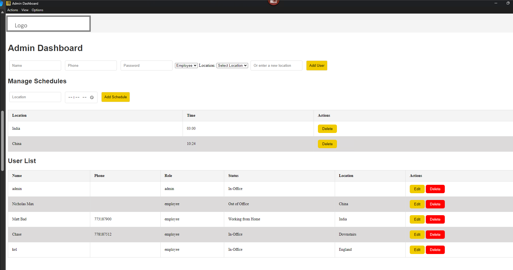

# Employee Status Dashboard
This is an Employee Status Dashboard where employees can update their current work status and search for other employees based on their name or location. The dashboard supports admin and employee roles, offering customized functionality for each role.

## Features

- **Employee Status Update**: Employees can update their current status (In-Office, Working from Home, On Leave, or a custom status).
- **User Search**: Employees can search for other employees by name using a fast search mechanism powered by a Trie data structure.
- **Location Filter**: Users can filter users based on their office location.
- **Real-Time Updates**: The dashboard automatically refreshes every second to keep employee statuses up to date.
- **Out of Office Scheduling**: Admins can set automatic "Out of Office" schedules for users based on location. For example:
  - `Scheduled "Out of Office" for India at 03:00`
- **Update Status Notification**: Users receive a notification of their last updated status upon login.
- **User Persistence**: Once logged in, users remain logged in until they explicitly log out.
- **Application Auto-Update**: The application automatically checks for updates and installs them on user machines, ensuring users always have the latest version.
- **Application Launch on PC Startup**: The application is configured to launch automatically when the PC starts.
- **Password Security**: Passwords are hardcoded but encrypted. The default admin credentials are:
  - Username: `admin`
  - Password: `gs`
  - 🚫 There is no "Forgot Password" or backdoor option.

## Screenshot



## Demo

[](https://youtu.be/qaVujcHjTYE)

Click the image to watch the video on YouTube.

---

## Getting Started
**License:** [CC BY-NC 4.0](https://creativecommons.org/licenses/by-nc/4.0/)  
### Prerequisites

To run the application, you need the following:

- **Node.js**: Install Node.js from [https://nodejs.org/](https://nodejs.org/)
- **Electron**: Install Electron globally using the following command:
  
  ```bash
  npm install -g electron
  ```

---

### Installing Dependencies

Clone the repository and navigate to the project directory:

```bash
https://github.com/KELVI23/employee-status-dashboard.git
cd Workhub
```

Then, install the required dependencies:

```bash
npm install
```

---

### Running the Application

To start the application, run the following command:

```bash
npm run start
```

This will open the login window of the Electron app. Upon successful login, the employee or admin dashboard will be displayed.

---

### Using the Application

- **Login**: Enter your name and password to log into the system.
- **Update Status**: Use the dropdown menu to select your status. If you choose "Custom," an additional input field will appear for you to enter a custom status.
- **Search Users**: Use the search bar above the user table to search for employees by name. The search is optimized using a Trie data structure for fast lookups. 🚫 *Bugs in feature*
- **Filter by Location**: Users can filter the users displayed based on the office location using the "View" menu.
- **Out of Office Scheduling**: Admins can add or delete schedules dynamically for specific locations and times. These schedules automatically set users in the specified location to "Out of Office" if they don’t have a custom status.
- **Notification on Login**: Users are notified to change their status upon login. Users will be notified upon system login in the future
- **Persistent Login**: Once logged in, users remain logged in until they explicitly log out.
- **Sort Columns**: Users can sort each column by clicking on table headers.

---

### Advanced Features for Admins

- **Manage Schedules**: Admins can:
  - Add schedules for specific locations and times.
  - Delete schedules when no longer needed.
  - View all schedules in a dynamic table.

Example schedule:
```plaintext
Location: India
Time: 03:00
Action: Automatically sets all non-custom statuses to "Out of Office" at the specified time.
```
---

## Search Mechanism

The search functionality is powered by a **Trie** data structure. This allows for efficient searching of users by name, even in large datasets.

- **Trie Implementation**: A Trie is used to store user names, and as the user types in the search bar, the Trie provides fast lookups for matching names.
- **Display of Results**: The results from the Trie search are displayed in the table, updating in real-time as you type.

---

### File Structure

- **`employee.html`**: The front-end HTML file for the Employee Dashboard.
- **`admin.html`**: The front-end HTML file for the Admin Dashboard, including schedule management functionality.
- **`login.html`**: The login page for users to authenticate.
- **`index.js`**: The Electron main process file, handling application logic and communication.
- **`backend/index.js`**: The Node.js backend server for API requests and database management.
- **`public/css/styles.css`**: The stylesheet for the project.
- **`db.js`**: Database configuration and initialization.
- **`preload.js`**: Handles the communication between Electron's main process and the renderer process.

---
## Production
- Remove backend from being packaged if you host backend on company server
remove the following from package.json

   ```json
   "files": [
     "**/*",
     "!node_modules/*/{CHANGELOG.md,README.md,README,readme.md,readme}",
     "!**/*.map",
     "backend/**/*"
   ]
   ```

and change 

   ```json
  "scripts": {
    "start": "concurrently \"npm run start:electron\" \"npm run start:backend\"",
    "start:electron": "electron . --no-sandbox",
    "start:backend": "node backend/index.js",
    "dist": "electron-builder",
    "test": "echo \"Error: no test specified\" && exit 1"
  },
   ```

to 

 ```json
"scripts": {
    "start": "electron . --no-sandbox",
    "dist": "electron-builder",
    "test": "echo \"Error: no test specified\" && exit 1"
  },
  ```

